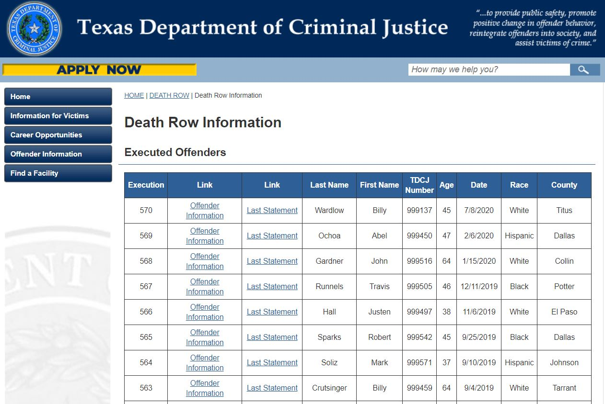

# Parser-Texas-PD
Texas is among 28 US states which still have death penalty. You can read each sentenced to death prisoner's last statement at Texas Department of Criminal Justice website https://www.tdcj.texas.gov/death_row/dr_executed_offenders.html.
It is interesting to know what people say at their last minutes.
This parser gathhers each statement in one txt file.
I want to write some script to upload txt file with statements to the wordclouds.com to make some graphic representation of the most 
used words.

## Website screenshot
Executed prisoners table

There are 570 names at the moment of publication (11/30/2020)

